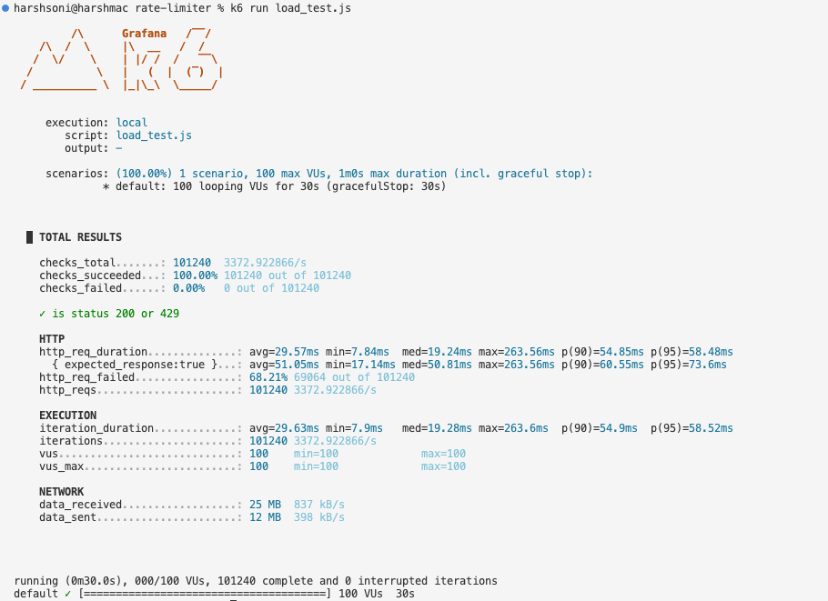

# Rate Limiter (Python + FastAPI + Redis)

A high-performance, horizontally scalable rate limiter built to learn how the token bucket algorithm works in a distributed system.

## Status: Multi-Client, Middleware-Based, Token Bucket (Redis + Lua)

This project implements rate limiting as FastAPI middleware. Originally built using an in-memory Python dictionary, it has been upgraded to use **Redis** and **Lua scripts** to support multiple distributed worker processes and prevent race conditions.

Multiple clients are identified by the `X-Client-Id` header. Clients are assigned a tier via the `tier` query param (`free` or `premium`), which determines their rate limit capacity and refill rate.

## How it works

- Rate limiting runs as **middleware** — it applies automatically to all protected endpoints. Routes like `/`, `/docs`, and `/openapi.json` are excluded.
- The state of each client's token bucket is stored in **Redis**. 
- Capacity is determined by client tier:
  - `premium`: 100 max capacity, refills at 20 tokens/sec
  - `free`: 10 max capacity, refills at 2 tokens/sec
- **The Race Condition Problem:** If 20 requests hit the server concurrently, multiple requests might read the exact same token count from Redis, do the math locally in Python, and overwrite each other, allowing users to completely bypass the limit.
- **The Lua Script Solution:** To make the rate limiter 100% thread-safe and atomic, the "read-modify-write" logic is implemented inside a tiny Lua script (`rate_limiter.lua`). Redis guarantees that Lua scripts execute atomically, completely eliminating race conditions.
- Refilling is **lazy** — it's calculated on-demand inside the Lua script based on the elapsed time since the user's last request, rather than relying on a heavy background timer loop.
- Rate-limit headers (`X-RateLimit-Limit`, `X-RateLimit-Remaining`, `X-RateLimit-Reset`) are injected back into the HTTP response by the middleware.

## Project structure

```text
├── main.py             # FastAPI app, middleware, and route handlers
├── rate_limiter.lua    # Atomic Lua script for Redis token math
├── script.py           # Concurrency test script (httpx + asyncio)
├── load_test.js        # k6 load testing script
├── models.py           # Legacy TokenBucket class and config
├── utils.py            # Legacy Python token math
└── pyproject.toml
```

## Running the server

1. Ensure you have Redis installed and running locally:
```bash
brew install redis
brew services start redis
```

2. Start the FastAPI server:
```bash
uvicorn main:app --reload --port 8000
```

## API

All `/api/*` endpoints are rate-limited. 

### `GET /api/ping` & `GET /api/tweets`

**Headers:**
- `X-Client-Id` (required): Client identifier string

**Query params:**
- `tier` (required): `free` or `premium`

**Example:**
```bash
curl -i 'localhost:8000/api/ping?tier=premium' -H 'X-Client-Id: alice'
```

## Testing

### 1. Concurrency Test Script
Run the test script to verify client isolation and that the Lua script correctly blocks race conditions:
```bash
uv run python script.py
```
This script fires 20 simultaneous async requests for Alice and 10 for Bob, proving that the atomic Lua script perfectly catches all over-limit requests.

### 2. Massive Load Testing with k6
To prove the architecture scales, you can blast the server with thousands of requests using [k6](https://k6.io/).
```bash
brew install k6
k6 run load_test.js
```
The load test spins up 100 Virtual Users firing concurrent requests for 30 seconds using randomly generated Client IDs to stress-test Redis bucket creation and parsing.

#### Performance Results



